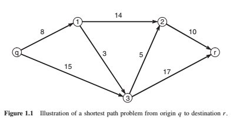

&emsp;&emsp;这一篇笔记中涉及了原书的前两章内容。

<!-- more -->

## 动态规划

&emsp;&emsp;带有时间维度的优化问题能从很多问题当中抽象出来。被称作序列决策问题Sequential Decision Problems）。这些问题包括了做决策，然后收集信息，然后继续做决策，收集信息如此往复。他们可以一直这样向前去建模，但是求解又是另一回事了。

&emsp;&emsp;动态规划扎根在许多领域，工程和经济领域着重解决连续状态和决策（这些人把决策称作控制），包括了量化的选址，调速和调温度。另外，运筹和人工智能更着重于离散的状态和决策。连续的状态和决策问题通常带着“控制理论”的帽子，然而离散的问题都带着“马尔科夫决策过程”的帽子。这两个领域都建立了递归的方程来紧凑的表达问题。许多高维度的问题例如资源的分配问题通常采用数学规划这种工具来表达。许多工作采用线性的，非线性的整数的，还有一个子领域叫做随机规划来处理不确定性问题。该书的研究将拓展这些领域。

### 1.1动态规划示例：最短路问题

&emsp;&emsp;最能说明动态规划的就是最短路问题了。如图一所示，假设一个司机要从节点 $q$ 开车到节点 $r$，所有节点的集合用 $\mathcal{I}$ 表示。当他从一个节点 $i$  进入下一个节点 $j$, $j \in {\cal I}_i^ + $ 需要花费 $c_{i,j}$ 。那么，问题是他如何选择路线使得费用最小。这个问题很容易用动态规划来表达，令$v_i$ 表示 从$ r$ 到$ i \in \mathcal{I}$ 的成本。

&emsp;&emsp;假设$v_r=0$，初始时我们不知道 $v_i$，我们设一个非常大的数 $M$ ，称为” 大$M$ ”。我们可以通过迭代式 $(1)$ 计算。

$$
\begin{equation}
v_i \leftarrow  min \left\{ {v_i},  \mathop { min } \limits_{j \in {\mathcal{I}^+ }}  \left\{ {c_{ij} + {v_j}} \right\} \right\} \forall i \in \mathcal{I} 
\tag{1}
\end{equation}
$$

&emsp;&emsp;这个式子需要迭代地求解，在每次求解过程中都需要遍历所有的节点。

### 1.2 三种维度灾难

&emsp;&emsp;确定性的问题可以写成 $(2)$ 。

$$
{V_t} \left( {S_t} \right) = \mathop{max}\limits_{a_t}  {\left( {C_t} \left( {S_t},{a_t} \right) + V_{t + 1} \left( {S_{t + 1}} \right)  \right)}
\tag{2}
$$

&emsp;&emsp;其中 $S_{t+1}$ 是在当前状态  $S_t$ 下采取行动 $a_t$ 的结果。这个式子被称为<u>贝尔曼方程</u>，或者是汉密尔顿-雅克比方程，或者是汉密尔顿-雅克比-贝尔曼方程（HJB)。这个方程在不同领域有着不同的名字。

&emsp;&emsp;在这些问题当中，有三种维度灾难

1. State space

2. Outcome space

3. Action Space

### 1.3 一些实际例子

### 1.4 问题类型