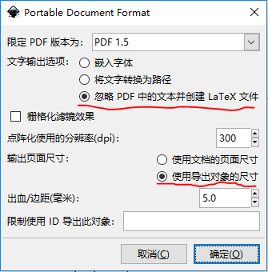
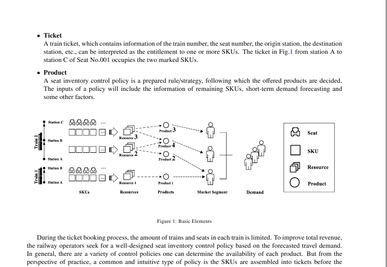

&emsp;&emsp;本篇文章介绍了用 LaTeX 和 Inkscape 绘制论文插图的小技巧。

<!-- more -->

# 引言

&emsp;&emsp;在通过LaTeX进行论文写作的过程中，创建论文插图是不可或缺的一环。在之前的使用中，我采用的是通过MS VISIO编辑图片，然后生成PDF文件，再通过LaTeX的includegraph命令导入到文档中，这样做有一个不方便的地方：**无论是PDF还是Visio文件都不是基于文本的，这意味着我无法用git进行图片的版本管理**。其次，visio并没有批量导出的功能，所以我必须一个一个地导出PDF。另外，由于visio属于MS OFFICE，使用它是需要付费的。接下来，我将介绍一个采用Inkscape的替代方案。

# 工作流程

## STEP 1 ：保存pdf文件 
&emsp;&emsp;对于Inkscape的绘图功能我不做重点介绍。在Inkscape中绘制好图后，通过保存/选择*.PDF会出现如下对话框（Inkscape 版本0.92）。点击"确定"后会生成两个文件`image.pdf`和`image.pdf_tex`。



&emsp;&emsp;保存好后，我的LaTeX工作目录如下所示。

>Root
>│  ... (省略其他文件)
>│  manuscript.tex
>│  mybibfile.bib
>│
>├─Figures
>│      image.svg
>│
>└─pdf
>        image.pdf
>        image.pdf_tex

## STEP 2： 在LaTeX文稿中引用PDF文件
&emsp;&emsp;在这个步骤中，我们在LaTeX中引入刚才生成的`.pdf_tex`文件，在LaTeX中插入以下代码。

```latex
\begin{figure}[!htbp] 
    \centering
    \def\svgwidth{\columnwidth}
    \input{pdf/image.pdf_tex}
\end{figure}
```

&emsp;&emsp;需要注意的是：

* 在LaTeX的头中需要引入`graphics`包。

* LaTeX默认的图片位置是根目录，如果需要将导出的文件放到子目录中（如本例中的pdf目录)，需要使用`graphicspath`命令。

```latex
\usepackage{graphics}
\graphicspath{{pdf/}}
```
结果如下图所示：



# 批量转换.svg文件

&emsp;&emsp;当我们画好了很多图片的时候，一张一张导入操作繁琐。我写了一个命令行脚本将`.svg`文件批量转化为`.pdf`和`.pdf_tex`文件。

`inkscape -D -z --file=image.svg --export-pdf=image.pdf --export-latex --export-area-drawing`

#参考资料

* 更多细节请参考下面这篇文章




