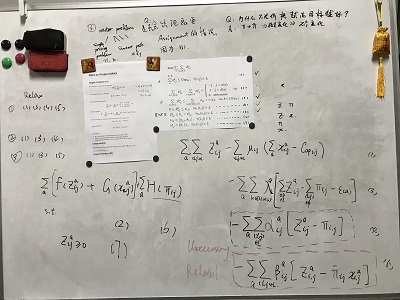

## Origin Problem (P1)

The objective is to maximize the total fare.
$$
\max \sum\limits_a {\sum\limits_{(i,j) \in L} {{\pi _{i,j}} \times x_{i,j}^a} }
$$

The capacity of each arc is bounded:
$$
\sum\limits_{a} {x_{i,j}^a}  \le Ca{p_{i,j}}, \ \ \ \forall (i,j) \in L
$$

Flow conservation constraints:
$$
\sum\limits_{i:(i,j) \in L} {x_{i,j}^a}  - \sum\limits_{i:(j,i) \in L} {x_{i,j}^a}  = \left\{ {\begin{array}{*{20}{c}}
{\begin{array}{*{20}{c}}
{ - 1}&{j = o\left( a \right)}
\end{array}}\\
{\begin{array}{*{20}{c}}
1&{j = d\left( a \right)}
\end{array}}\\
{\begin{array}{*{20}{c}}
0&{otherwise}
\end{array}}
\end{array}}\right.,\ \ \ \forall a
$$

BRUE constratins:
$$
\sum\limits_{(i,j) \in L} {{\pi _{i,j}} \times x_{i,j}^a \le \sum\limits_{(i,j) \in \phi \left( {{w_a},k} \right)} {{\pi _{i,j}} + \varepsilon \left( a \right)} }, \ \ \ \forall a,k \in \Omega \left( {{w_a}} \right)
$$

The fare on each arc should be bounded: (We assume ${0 \le \underline \pi _{i,j}} \le {{\bar \pi }_{i,j}}$)
$$
{\pi _{i,j}} \in \left[ {{\underline \pi _{i,j}},{{\bar \pi }_{i,j}}} \right],  \ \ \forall (i,j) \in L
$$

Other constraints:
$$
x_{i,j}^a = \left\{ {0,1} \right\},\ \ \ \forall a, (i,j) \in L\\
$$

Notifications:

* $x_{i,j}^a$ is an indicator of whether agent $a$ pass through link $(i,j)$.
* $\Omega \left( {{w_a}} \right) $ is the set of possible paths of OD pair $w(a)$ of agent $a$.
* $\phi \left( {{w_a},k} \right)$ is the set of links in the $k$ th path of OD pair $w(a)$ of agent $a$.

## Linearization 

**Proposion** : $Z_{i,j}^a \Leftrightarrow  \left( {\pi _{i,j}}, x_{i,j}^a \right)$ when $0 \le Z_{i,j}^a \le {\pi _{i,j}} \times x_{i,j}^a$ and $Z_{i,j}^a \le {{\bar \pi }_{_{i,j}}}\times x_{i,j}^a $

P1 and P2 are equivalent.

## Linear Problem (P2)

$$
\begin{array}{l}
\max \sum\limits_a {\sum\limits_{(i,j) \in L} {Z_{i,j}^a} } \\
s.t. \\
\sum\limits_{a} {x_{i,j}^a}  \le Ca{p_{i,j}}, \ \ \ \forall (i,j) \in L\\
\sum\limits_{i:(i,j) \in L} {x_{i,j}^a}  - \sum\limits_{i:(j,i) \in L} {x_{i,j}^a}  = \left\{ {\begin{array}{*{20}{c}} 
{\begin{array}{*{20}{c}}
{ - 1}&{j = o\left( a \right)}
\end{array}}\\
{\begin{array}{*{20}{c}}
1&{j = d\left( a \right)}
\end{array}}\\
{\begin{array}{*{20}{c}}
0&{otherwise}
\end{array}}
\end{array}} \right.,  \ \ \ \forall a\\
\sum\limits_{(i,j) \in L} {Z_{i,j}^a \le \sum\limits_{(i,j) \in \phi \left( {{w_a},k} \right)} {{\pi _{i,j}} + \varepsilon \left( a \right)} }, \ \ \ \forall a,k \in \Omega \left( {{w_a}} \right) \\
0 \le Z_{i,j}^a \le {\pi _{i,j}},  \ \ \ \forall a, (i,j) \in L\\
Z_{i,j}^a \le {{\bar \pi }_{_{i,j}}}\times x_{i,j}^a, \ \ \ \forall a, (i,j) \in L\\
{\pi _{i,j}} \in \left[ {{\underline \pi _{i,j}},{{\bar \pi }_{i,j}}} \right], \ \ \ \forall (i,j) \in L\\
x_{i,j}^a = \left\{ {0,1} \right\}, \ \ \ \forall a, (i,j) \in L\\
\end{array}
$$

## Lagrangian Decomposition

$$
\begin{array}{l}
\max \sum\limits_a {\sum\limits_{(i,j) \in L} {Z_{i,j}^a} }  - 
\lambda \times  \left(
\sum\limits_{(i,j) \in L} {Z_{i,j}^a - \sum\limits_{(i,j) \in \phi \left( {{w_a},k} \right)} {{\pi _{i,j}} - \varepsilon \left( a \right)} } \
\right)
-\sum\limits_{(i,j) \in L}\mu_{i,j} \times \left(
\sum\limits_{a} {x_{i,j}^a}  - Ca{p_{i,j}}
\right)
\\

\sum\limits_{i:(i,j) \in L} {x_{i,j}^a}  - \sum\limits_{i:(j,i) \in L} {x_{i,j}^a}  = \left\{ {\begin{array}{*{20}{c}}
{\begin{array}{*{20}{c}}
{ - 1}&{j = o\left( a \right)}
\end{array}}\\
{\begin{array}{*{20}{c}}
1&{j = d\left( a \right)}
\end{array}}\\
{\begin{array}{*{20}{c}}
0&{otherwise}
\end{array}}
\end{array}} \right.\\

0 \le Z_{i,j}^a \le {\pi _{i,j}}\\
Z_{i,j}^a \le {{\bar \pi }_{_{i,j}}}\times x_{i,j}^a \\
{\pi _{i,j}} \in \left[ {{\underline \pi _{i,j}},{{\bar \pi }_{i,j}}} \right]\\
x_{i,j}^a = \left\{ {0,1} \right\}

\end{array}
$$

$$\max \sum\limits_a {\sum\limits_{(i,j) \in L} {\beta_{i,j} \times {\pi _{i,j}} \times x_{i,j}^a} } $$

