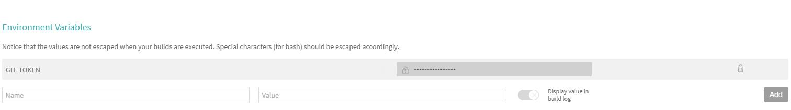
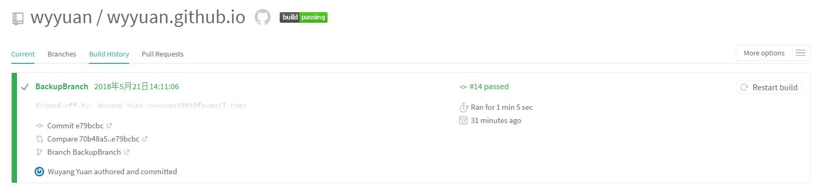

&emsp;&emsp;本篇文章是我自己搭建了一个Travis.ci环境以自动发布hexo博客的一个实践。

<!-- more -->

# 通过Travis CI对Hexo博客进行持续集成

## Hexo 简介

&emsp;&emsp;Hexo 是一个Node.js上搭建静态博客的工具，其最吸引我的特点就是可以通过Markdown来写博客。本博客就是采用Hexo搭建的。我在搭建博客的时候参考了以下资料

* [搭建Hexo博客](https://www.jianshu.com/p/2640561e96f8)
* [在Hexo中渲染MathJax数学公式](https://www.jianshu.com/p/7ab21c7f0674)
* [HEXO+Github,搭建属于自己的博客](https://www.jianshu.com/p/465830080ea9)

&emsp;&emsp;根据以上说明可以通过Github Pages搭建一个自己的博客。但是由于是静态页面，每次更新都要从一个Node.js环境上运行Hexo。有没有办法可以简化这个过程呢？

## Travis CI简介

&emsp;&emsp;引用[廖雪峰的官方网站](https://www.liaoxuefeng.com/)对Travis CI的介绍。

>Travis CI是在线托管的CI服务，用Travis来进行持续集成，不需要自己搭服务器，在网页上点几下就好，用起来更方便。最重要的是，它对开源项目是免费的。

&emsp;&emsp;其中CI代表持续集成(Continuous Integration)，这是一种自动编译和发布代码的技术。而Travis CI在线提供了这种服务，并且可以与Github无缝衔接。接下来就简单介绍一下我是如何配置Travis CI的。


## 简单配置

&emsp;&emsp;我的配置分为以下几步：

1. 通过Githun账号登录Travis CI
  &emsp;&emsp;打开[Travis CI](https://travis-ci.com/)，选择Sign In With Github即可。
2. 配置Personal Token
   * 在Github上Setting中找到[Personal access tokens设置](https://github.com/settings/tokens)。
   * 点*Generate new token*，生成一个新的Token并记录好。（这个只会出现一次！！）
   * 将上一步生成的Token 加入Traivis CI。在Traivis CI的右上方选More options>Setting>Environment Variables。Name为GH_TOKEN，Value则是刚才的Token，最后点"Add"。


3. 在项目中加入.travis.yml，我的配置如下。注意我的Hexo博客文件在BackupBranch分支中，public目录下的内容被发布到master分支。

```yaml
# 指定语言环境
language: node_js
# 指定需要sudo权限
sudo: required
# 指定node_js版本
node_js: 
 - 7.9.0
# 指定缓存模块，可选。缓存可加快编译速度。
cache:
  directories:
    - node_modules

# 指定博客的仓库地址
env:
 global:
   - GH_REF: github.com/wyyuan/wyyuan.github.io.git

# 指定博客分支
branches:
  only:
    - BackupBranch 

before_install:
  - npm install -g hexo-cli

# Start: Build Lifecycle
install:
  - npm install
  - npm install hexo-deployer-git --save

# 执行清缓存，生成网页操作
script:
  - hexo clean
  - hexo generate

# 设置git提交名，邮箱；替换真实token到_config.yml文件，最后depoy部署
after_script:
  # 替换同目录下的_config.yml文件中gh_token字符串为travis后台刚才配置的变量，注意此处sed命令用了双引号。单引号无效！
  #- sed -i "s/gh_token/${GH_TOKEN}/g" ./_config.yml
  #- hexo deploy
  - cd ./public
  - git init
  - git config user.name "WuyangYuan"
  - git config user.email "yuanwuyang@foxmail.com"
  - git add .
  - git commit -m "Update docs"
  - git push --force --quiet "https://${GH_TOKEN}@${GH_REF}" master:master

# End: Build LifeCycle
```

4. 测试

* 修改仓库后提交，结果如下图所示，成功！




