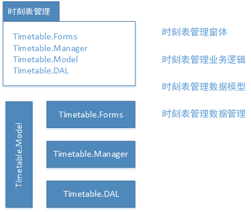
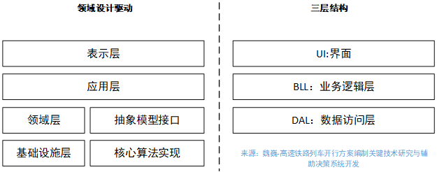
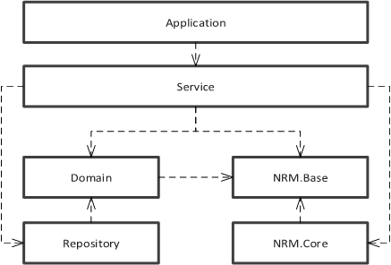
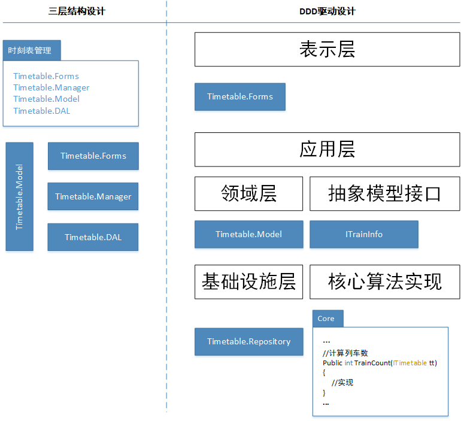
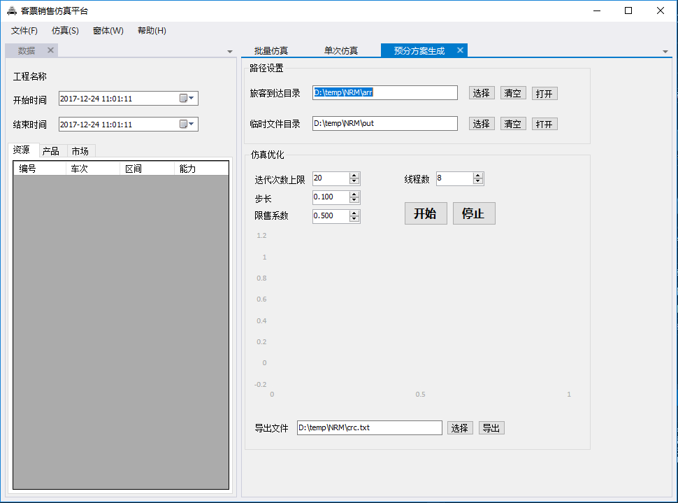
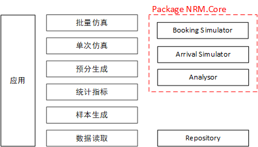
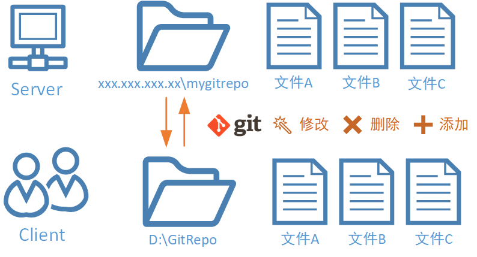
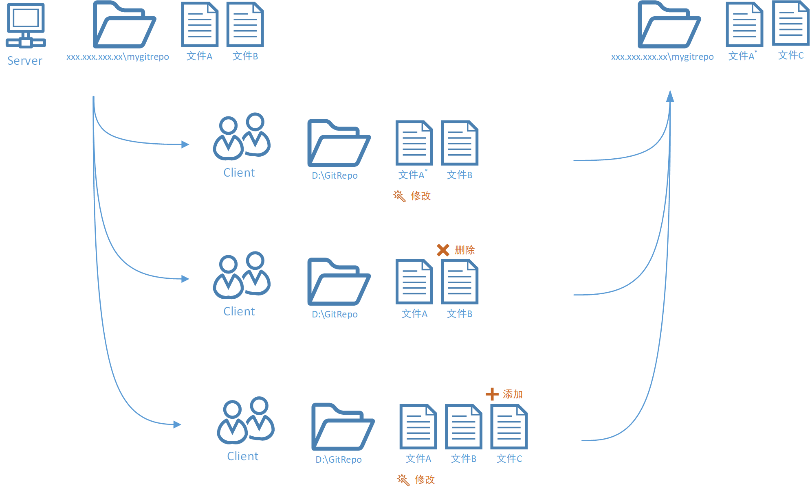

# 编程漫谈——问题，套路与工具

## 主题1：系统设计-信息管理与算法实现

### 视角：科研VS产品

&emsp;&emsp;在科研过程中，我们经常需要自己动手实现一些算例验证算法。我们通常会进行多组算例的验证，这些算例的背景可能大不相同。例如，如果我要实现开行求解开行方案编制问题的算法，而我此时有两套数据：公交网络和铁路网络。这两套网络的数据结构**不相同**，以构建网络中的弧为例：

> 公交网络弧段：前序弧段，后续弧段...**设计速度，道路宽度，道路长度**...
> 铁路网络弧段：前序弧段，后续弧段...**运营速度，长度，坡度，信号制式**...

&emsp;&emsp;当然，如果就算法实现而言，我们只要把这两个网络相同的部分建模实现就好。即：

> 抽象弧段：前序弧段，后续弧段

&emsp;&emsp;但是，当我们需要把算法包装成产品（推向市场或者完成实际项目），这样做是不够。如果一个产品仅仅实现一个算法，对于使用者来说，学习的成本太高（这里的使用者包括企业用户和科研用户）。所以通常我们还需要在产品中集成另一部分功能——信息管理。

&emsp;&emsp;这里说的信息管理根据对不同项目有不同的含义。以我亲身参与的几个项目来说：

| 项目名称       | 项目维护的信息          | 采用的算法 |
| ---------- | ---------------- | ----- |
| 项目A:铁路货场管理 | 货位，股道            | 状态机模型 |
| 项目B:工务管理   | 钢轨，道岔及其相关配件的状态数据 | HMM   |
| 项目C:地震管理   | 地震，铁路路网，列车时刻表    | 插值算法  |
| 开行方案评估项目   | 铁路路网，时刻表信息       |       |

&emsp;&emsp;通常，这些信息可以存放在文件系统或者数据库中。通常信息管理要实现的功能就是对这些信息记录的增删改查（CURD）。信息管理的功能单一，而且一般来说在不同编程语言下都有比较好的工业化实现(Java 的 SSH框架 .NET 的 Entity Framework)。

&emsp;&emsp;所谓“大“系统，无非就是集成了**信息管理**与**算法实现**这两个功能的系统。同时在此基础上再提供良好的交互和丰富的接口，使之能为更多不同目的的使用者服务。

### 挑战：如何设计一个大系统

&emsp;&emsp;那么如何设计这样一个“大”系统呢？其中的主要问题是，相对于比较成熟的信息管理系统，**算法的实现占了更大的比重**，这也就要求有更好的方式将两者集合起来。以时刻表管理功能为背景，需求如下：

* 实现时刻表在数据库中的增删改查。

* 从时刻表中计算指标，如车数、平均旅行时间、可达性等等。

  ​

### 回顾：开行方案评估系统

&emsp;&emsp;评估系统主要功能有：

* 维护路网、时刻表、和客流信息。

* 时刻表分析和指标计算

* 客流分析和指标计算

  评估系统主要采用的是三层结构，一个具体的例子如下：

 

&emsp;&emsp;这种结构好处很明显：每个模块结构紧密，易于理解。

&emsp;&emsp;缺陷：

  * 算法复用性问题

  &emsp;&emsp; 在这个结构中，算法是在manager中实现的。对于不同项目数据模型model大不相同。由于manager对model的依赖。导致增加了model后也需要对manager进行修改，违反了“开闭原则”（对扩展开放，对修改关闭）。而事实上算法的核心功能并未改变。

```c#
      public class ShortestPathSearcher
      {
        public Path DoSearch(RailwayNetwork net)
      }
```

&emsp;&emsp; 如果上述网络中的 RailwayNetwork 被替换为 AirNetwork 那么整个ShortestPathSearcher类都要被修改。而这种修改显然是不受欢迎的。

  * 充血模型问题

&emsp;&emsp; 在这个结构中，从设计上来说是要放manager的。但是实际中，业务逻辑有时被放到model中，有时也被放到manager中。

&emsp;&emsp; 例如在计算列车收入指标中，某tjn同学在TTtrainInfo类中加入： 

```c#
public class TTtrainInfo
{
  ...
  double TotalRev { get; set;}
  ...
}
```

&emsp;&emsp; 虽然这个错误的产生于充血模型无关，但是这种结构允许了错误发生的可能性。

###设计：DDD驱动架构

&emsp;&emsp; 领域模型驱动设计(Domain-Driven Design, DDD)，是一种更加贴近业务实现的设计方式。在此基础上，我将算法需要的输入和算法实现分别抽出，成为两层。

 

具体来看：

 

从应用实现的角度上来讲（还是以时刻表为例）：

 

### 应用：客票销售仿真系统

每一层要实现的功能：（以客票销售仿真系统为背景）

* 表示层：这一层主要负责与用户的交互逻辑，实现可以是Winform\WPF\ASP.NET

 

* 应用层：这一层有两个任务：
    * 整合核心算法和领域资源
    * 提供访问各功能的接口
       
* 领域层：要维护的信息对象的结构
* 基础设施层：信息对象的持久化，与数据库、文件系统交互。

## 主题2：一个套路 OO+Matlab+Yalmip+Cplex

&emsp;&emsp; 虽然大系统的愿景很美好，但是付出的时间成本也是很多的，对于交通专业的硕士生同学来说，独立开发一个大系统难度确实太大。而且大部分时候，为了验证一个模型去开发一个大系统也是得不偿失的（没有人会这么做）。

&emsp;&emsp; 那么，如何应对这种快速开发的需求呢？

&emsp;&emsp; 解决这个问题的关键就是尽量用“胶水”而非造“轮子”。Matlab/Python都是不错的“胶水”，而Cplex或者一些第三方C++/.net库都是好用的“轮子”。

 


## 主题3：一个重要代码工具 Git 与合作平台 Coding.Net

### Git是什么?

* 一款免费、开源的**分布式版本控制系统**

* Git是**文件管理系统**

* Git以**目录**的方式管理文件

 

  ​

### 为什么使用Git?

* 简单、高效
* 适合团队协作

### 工作流程

 


