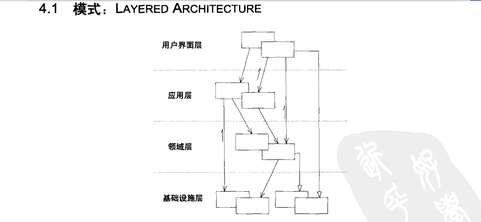

&emsp;&emsp;本文是我在2018年9月团队Workshop上所讲内容的底稿。为方便各位同学学习交流，发布于此。[Slide](./slides/workshop2018-2019_1.html)
<!-- more -->

## 引言

&emsp;&emsp;在上一次的漫谈中，我结合团队的研究方向，对我们要开发的计算机软件进行了需求分析。目前来看，我们想要通过编程解决两个问题：
* 信息管理 —— 我们需要维护，管理，可视化基础数据
* 算法实现 —— 我们需要将科研当中的算法运用到实际的案例上

&emsp;&emsp;实现上述两个功能在程序的设计上带来了巨大的挑战。因为我们希望开发出的软件具有良好的**可维护性**和**代码可读性**。具体说来，就是将算法实现和信息管理功能彻底解耦。

&emsp;&emsp;举例来说，在公交系统中，一个网络弧段通常用一系列字段描述： `前序弧段`，`后续弧段`...`设计速度`，`道路宽度`，`道路长度`。在铁路网络中，网络弧段的描述则是：`前序弧段`，`后续弧段`，`运营速度`，`长度`，`坡度`，`信号制式`。如果我们要在这个两种网络当中实现最短路算法，我们希望这个算法只写一遍（尽量减少冗余代码）。事实上，我们研究的问题不止一个，而提出的算法更多，我们希望能把这些工作整理在一个程序中，同时，考虑到以后的研究，我们希望这个程序能够减少未来的工作量。这个问题属于软件工程的研究范畴。为了解决我们的问题，下面我要引入一些软件工程上的方法论。

## Domain-Driven Design (DDD) 领域模型驱动设计
&emsp;&emsp;为了解决复杂软件设计的问题，Eric Evans 在[《领域驱动设计——软件核心复杂性应对之道](http://book.douban.com/subject/1629512/)》中详细介绍了DDD设计思想。从我的个人理解出发，DDD模式以业务逻辑（领域）为核心进行软件设计，注重对业务的划分，聚合，而对资源的操作用Repository封装。这样做的好处是显而易见的——我们可以把注意力集中在业务逻辑上。

&emsp;&emsp;DDD模式将软件系统分为四层：基础结构层、领域层、应用层和表现层，层与层之间的依赖关系如下图所示。在领域层中，我们只需要完成对业务设计就好，至于其中所用到的数据的读写则是基础设施层需要实现的。介绍DDD的设计思想不是本文的重点，下面我们着重介绍如何对目前我的研究问题进行建模。


## 高速铁路客运服务网模型
&emsp;&emsp;在对铁路客运服务网的研究当中，主要要素包含：物理网络，开行方案， 运行图（宏观）以及活动设备计划（e.g. 交路计划）。而我们团队主要研究的问题包括：
- **开行方案编制问题**
- **宏观运行图编制问题**
- **动车组交路编制及检修问题**
- **客流预测问题**

&emsp;&emsp;在过去十多年的研究当中，在以上这些问题的研究中，我们提出了很多模型及算法。再次强调的是，我们的目标是将这些模型与算法在统一的平台实现。注意：大家的模型和算法基于的具体实例可以是不同的（例如前面所论述的公交与铁路的例子），但是大家的问题输入与输出基本相同。为了解开数据管理与问题求解之间的耦合，首先需要划分模块并设计接口。这样做的好处是编制算法的时候我们并不需要网络的很多细节，而修改路网的某些字段也不会对算法运行造成影响。

### 基础路网
&emsp;&emsp;基础路网的元素包含：路网，线路，车站和区间。这里为了结合运输计划的建模，我把物理路径也放到了这一层。

- 路网

  ```c#
  public interface IRailwayNetwork
  {
      IEnumerable<IRailwaySection> SectionCollection { get; } //区间集合
      IEnumerable<IRailwayStation> StationCollection { get; } //车站集合
      IEnumerable<IRailwayLine> LineCollection { get; } //线路集合
  }
  ```

- 车站

  ```c#
  public interface IRailwayStation
  {
      int RailwayStationID { get; }
      string StaName { get; }
  }
  ```

- 区间

  ```c#
  public interface IRailwaySection
  {
      int RailwaySectionID { get; }
      string RailwaySectionName { get; }
      IRailwayStation StartSta { get; }
      IRailwayStation EndSta { get; }
  }
  ```

- 线路

  ```c#
  public interface IRailwayLine
  {
      int RailwayLineID { get; set; }
      IEnumerable<IRailwaySection> RailwaySections { get; }
      IEnumerable<IRailwayStation> RailwayStations { get; }
  }
  ```

- 物理网路径

  ```c#
  public interface IRailwayNetRoute
  {
      IEnumerable<IRailwaySection> AlongSectionList { get; } // 区间列表
      IEnumerable<IRailwayStation> AlongStaList { get; } // 途径车站列表
  }
  ```

### 运输计划模型

&emsp;&emsp;这里以开行方案为例展示如何对运输计划进行设计。注意，运输计划需要基于路网对象实例的。也就是说，当我们提到"北京西站"的时候，是指特定的一个车站对象。

- 方案线

  ```c#
  public interface ILine
  {
      string Name { get; } // 方案线名称
      IRailwayNetRoute Route { get; } // 物理路径
      IEnumerable<IRailwayStation> StopStations { get; } // 停站车站集合
  }
  ```

- 开行方案

  ```c#
  public interface ILineLlan: IEnumerable<ILine>
  {
      string Name { get; }
  }
  ```

&emsp;&emsp;运行图？？交路？？

### 客运需求模型

&emsp;&emsp;？？？

## 问题-求解器模型

&emsp;&emsp;上面的建模解决的是问题的输入—输出的表达一致性问题。但是这并不是问题的全部，在DDD模式中，我们需要找到适合的聚合根 (Aggregated Root) 完成对数据的读取/存储。问题环境 (Problem Data Context) 就是这样的一个聚合根。它包含一个问题的所有输入，以运行图编制问题为例，Data Context包含以下内容。

```C#
public interface ITTPDataContext // TTP问题环境
{
    IRailwayNetwork Net { get; set; } // 物理网络
    ILineLlan LinePlan { get; set; } // 开行方案
    double ArrArrHeadway(IRailwayStation sta); // 到-到间隔
    double DepDepHeadway(IRailwayStation sta); // 发-发间隔
    double LowerBoundDwellingTimeInStation(ILine l, IRailwayStation sta); // 最小停站时间
    double UpperBoundDwellingTimeInStation(ILine l, IRailwayStation sta); // 最大停站时间
    double LowerBoundRunningTimeInSection(ILine l, IRailwaySection sec); // 最小区间运行时间
    double UpperBoundRunningTimeInSection(ILine l, IRailwaySection sec); // 最大区间运行时间
    double LowerBoundStartTime(ILine l); // 最早发车时间
    double UpperBoundStartTime(ILine l); // 最晚发车时间
}
```

&emsp;&emsp;另一方面，问题的求解也需要封装起来便于调用。对于一类问题环境，我们可以设计一个求解器，典型的问题求解器如下。

```c#
public class TTPSolver
{
    public virtual ITTPDataContext DataContext { get; set; }

    public ITimeTable Solve()
    {
        // Solution Method Code
        // ...
        // ...
    }
}
```

&emsp;&emsp;应用层主要可以通过以下步骤来求解问题：

1. 从Repository 生成 Data Context

2. 调用 Solver 求解问题。

   简单的代码示例如下：

```c#
public OperationResponse GenTimeTable(string wsName)
{
    //Some codes...
    RailwayNetwork net = NetRepos.Network;  //NetRepos是路网的Repostory
    LinePlan p = TTPRepos.GenLinePlan(wsName, net); //TTPRepos是运行图编制问题输入的Repostory
    ITTPDataContext ctx = TTPRepos.GenCtx(wsName);
    TTPSolver solver = new TTPSolver
    {
        Net = net,
        LinePlan = p,
        DataContext = ctx,
        TTBuilder = new TimetableBuilder()
    };
    solver.Solve();
    //Some codes...
}
```

## 总结

&emsp;&emsp;本文主要介绍了DDD模式下设计高速铁路客运服务网的一些细节。


