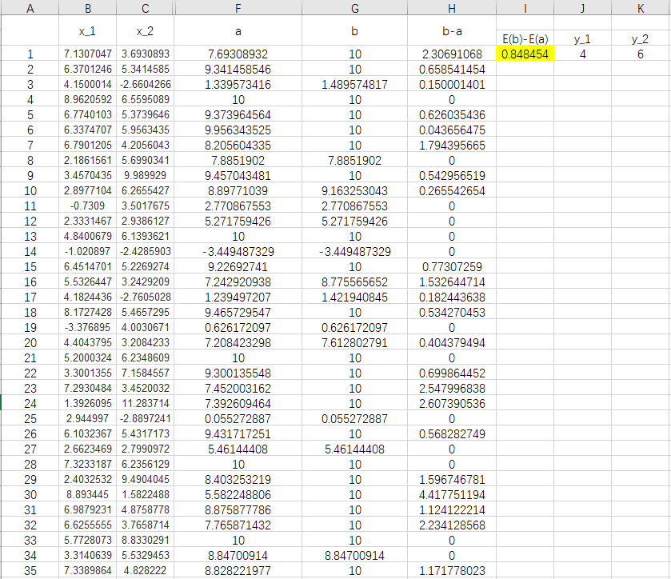

&emsp;&emsp;考虑两个相互独立的随机变量$x_1$和$x_2$和两个参数$y_1$和$y_2$。比较$a$和$b$的期望$E(a)$和$E(b)$的大小。
- $a=min\{x_1,y_1\}+min\{x_2,y_2\}$
- $b=min\{x_1+x_2,y_1+y_2\}$

&emsp;&emsp;我做了100次随机试验，参数设置如下。
- $x_1$和$x_2$均服从参数为(5,3)的正态分布
- $y_1=4,y_2=6$

结果如下。

&emsp;&emsp;我尝试了不同的参数取值，但是结果都是$E(b) > E(a)$。这里面也许存在一个恒等式，但是我太懒了，还没推导。
